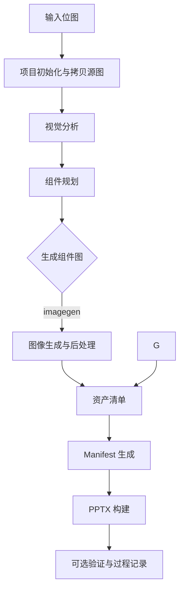

# Image2PPT OpenAI-Compatible Workflow (Vision + ImageGen)

This folder contains an OpenAI-compatible workflow that follows the
bggg-creator-image2ppt process for bitmap inputs. It adds:

- Vision analysis (Qwen-VL or any OpenAI-compatible vision model).
- Image generation for non-text components (DashScope Z-Image-Turbo or any
  OpenAI-compatible image endpoint).
- Manifest generation and PPTX build via the existing skill scripts.

## Install

```bash
pip install -r requirements.txt
```

## Run 

```bash
python agent_workflow.py --source D:\Desktop\南网\ppt图片.png --vision-model qwen3.6-35b-a3b --vision-base-url https://dashscope.aliyuncs.com/compatible-mode/v1 --imagegen-model qwen-image --imagegen-base-url https://dashscope.aliyuncs.com/api/v1/services/aigc/multimodal-generation/generation --imagegen-api-style qwen                        
```

Example with DashScope:


## 1. 目标与范围

本报告覆盖 langchain 工作流的端到端实现，重点描述从位图输入到可编辑 PPTX 输出的完整链路，包括视觉分析、组件规划、资产生成、清单生成与渲染验证。核心入口为 [langchain/agent_workflow.py](langchain/agent_workflow.py)。

## 2. 目录与核心模块

- 入口与编排: [langchain/agent_workflow.py](langchain/agent_workflow.py)
- 提示词模板: [langchain/prompts.py](langchain/prompts.py)
- OpenAI 兼容对话客户端: [langchain/openai_client.py](langchain/openai_client.py)
- 图像生成与后处理: [langchain/imagegen.py](langchain/imagegen.py)
- Manifest -> PPTX 渲染器: [langchain/image2pptx.py](langchain/image2pptx.py)
- 辅助工具与 JSON 修复: [langchain/tools.py](langchain/tools.py)
- 批量模型测试脚本: [langchain/test.py](langchain/test.py)
- 视觉报告重命名脚本: [langchain/rename_vision_reports.py](langchain/rename_vision_reports.py)
- 运行说明与环境变量: [langchain/README.md](langchain/README.md)
- 依赖清单: [langchain/requirements.txt](langchain/requirements.txt)

## 3. 工作流总览



## 4. 关键流程细节

### 4.1 项目初始化与输入准备

- 入口参数 `--source` 指向输入位图，项目目录在 langchain/projects 下按日期和模型命名创建。
- 初始化时会将源图复制到 original_inputs 中，确保追溯性与复跑一致性，逻辑在 [langchain/tools.py](langchain/tools.py) 和 [langchain/agent_workflow.py](langchain/agent_workflow.py)。

### 4.2 视觉分析 (Vision)

- 输入图像被编码为 data URL，并与 ANALYSIS_PROMPT 组合请求视觉模型，解析为分析 JSON。
- 解析由 `parse_llm_json` 完成，包含 JSON 抽取与转义修复，确保坏格式可恢复。
- 输出为 diagnostics/analysis.json，执行逻辑在 [langchain/agent_workflow.py](langchain/agent_workflow.py) 与 [langchain/tools.py](langchain/tools.py)。

### 4.3 组件规划 (Component Plan)

- 根据分析 JSON 生成可绘制资产列表，输出 diagnostics/component_plan.json。
- 每个资产包含 `bbox`、`prompt`、`negative_prompt`、`transparent` 等关键字段，逻辑在 [langchain/prompts.py](langchain/prompts.py) 与 [langchain/agent_workflow.py](langchain/agent_workflow.py)。

### 4.4 组件生成与裁剪

- 默认走 imagegen 生成：调用 OpenAI 兼容或 DashScope/Qwen 风格 API 生成图像，支持自动尺寸调整与 PNG 标准化。
- 图像生成与后处理实现位于 [langchain/imagegen.py](langchain/imagegen.py)，控制流程在 [langchain/agent_workflow.py](langchain/agent_workflow.py)。

### 4.5 资产清单与 Manifest 生成

- 资产输出后写入 diagnostics/asset_catalog.json，作为 Manifest 生成的输入之一。
- Manifest 通过 MANIFEST_PROMPT 生成，并补齐 deck 尺寸参数，写入 manifest.json。
- 逻辑集中于 [langchain/agent_workflow.py](langchain/agent_workflow.py) 与 [langchain/prompts.py](langchain/prompts.py)。

### 4.6 PPTX 渲染与验证

- Manifest 由 [langchain/image2pptx.py](langchain/image2pptx.py) 渲染为 PPTX，并输出 summary.json 统计信息。
- 可选验证步骤统计页数和形状数，结果写入 process_notes.md，逻辑在 [langchain/tools.py](langchain/tools.py) 与 [langchain/agent_workflow.py](langchain/agent_workflow.py)。

## 5. 数据契约与文件产物

### 5.1 诊断与中间结果

- diagnostics/analysis.json: 画布尺寸、背景、文本块、对象与形状。
- diagnostics/component_plan.json: 资产生成计划。
- diagnostics/asset_catalog.json: 资产文件与 bbox 记录。
- diagnostics/manifest_raw.txt 与 diagnostics/analysis_raw.txt 等原始 LLM 输出（可选）。

### 5.2 最终产物

- manifest.json: 供 PPTX 渲染的最终清单。
- output.pptx: 可编辑 PPTX 输出。
- summary.json: 统计与渲染概要。
- process_notes.md: 运行模式与关键信息记录。

## 6. 模型与 API 适配

- 视觉分析与 Manifest 使用 OpenAI 兼容 chat 接口，调用逻辑在 [langchain/openai_client.py](langchain/openai_client.py)。
- 图像生成同时适配 OpenAI 风格与 Qwen/DashScope 风格接口，响应解析兼容 base64 与 URL 形式，详见 [langchain/imagegen.py](langchain/imagegen.py)。


## 7. 可靠性与错误处理

- `retry_llm_call` 针对 JSON 解析失败自动重试，降低 LLM 格式波动风险。
- JSON 修复逻辑可处理未转义引号，避免解析失败。
- 输入文件缺失、bbox 无效、元素类型不支持会明确抛错，便于定位问题。
- 图像生成失败会包含 HTTP 状态与错误文本，便于追踪上游响应。


