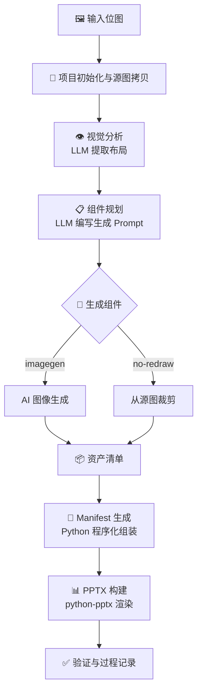

# Image-to-PPT：从位图到可编辑 PPTX 的端到端 LLM 工作流

> **一句话概述**：将一张幻灯片截图（PNG / JPEG / WebP）自动转换为原生可编辑的 `.pptx` 文件，保留文本、形状、图标等所有元素的布局与样式。

---

## 目录

- [项目结构](#项目结构)
- [快速开始](#快速开始)
  - [环境要求](#环境要求)
  - [安装依赖](#安装依赖)
  - [环境变量配置](#环境变量配置)
  - [运行示例](#运行示例)
- [命令行参数](#命令行参数)
- [工作流解析](#工作流解析)
  - [总体流程](#总体流程)
  - [Step 1 — 项目初始化](#step-1--项目初始化)
  - [Step 2 — 视觉分析 (Vision Analysis)](#step-2--视觉分析-vision-analysis)
  - [Step 3 — 组件规划 (Component Plan)](#step-3--组件规划-component-plan)
  - [Step 4 — 资产生成 / 裁剪](#step-4--资产生成--裁剪)
  - [Step 5 — Manifest 生成](#step-5--manifest-生成)
  - [Step 6 — PPTX 构建与验证](#step-6--pptx-构建与验证)
- [Analysis 方法详解](#analysis-方法详解)
  - [方法 1：单次联合分析（默认）](#方法-1单次联合分析默认)
  - [方法 2：分离分析 —— 文本与图形分步提取](#方法-2分离分析--文本与图形分步提取)
- [模型选择](#模型选择)
  - [视觉模型](#视觉模型)
  - [图像生成模型](#图像生成模型)
- [PPTX 渲染能力](#pptx-渲染能力)
- [可靠性设计](#可靠性设计)
- [扩展点](#扩展点)
- [数据契约](#数据契约)
- [脚本工具](#脚本工具)
- [常见问题](#常见问题)

---

## 项目结构

```
Image-to-ppt/
├── agent_workflow.py          # 🔧 主入口：工作流编排器 (~687 行)
├── requirements.txt           # Python 依赖清单
├── README.md                  # 本文档
├── docs/
│   └── TECH_REPORT.md         # 技术报告
├── source/
│   ├── prompts.py             # 📝 所有 LLM 提示词模板
│   ├── openai_client.py       # 🌐 OpenAI 兼容对话客户端
│   ├── imagegen.py            # 🎨 图像生成模块（多 API 适配）
│   ├── image2pptx.py          # 📊 PPTX 渲染器 (~680 行)
│   └── tools.py               # 🛠 工具函数（JSON 修复、抠图、项目初始化等）
├── scripts/
│   ├── bgremove.py            # 批量背景移除脚本
│   ├── imagegen_local.py      # 本地图像生成测试
│   ├── rename_vision_reports.py# 批量重命名视觉报告
│   ├── test.py                # 多模型批量测试
│   └── vlm_local.py           # 本地 VLM 测试脚本
├── package/                   # 预下载的 wheel 包
├── rembg/                     # rembg 相关 wheel 包
└── projects/                  # 按日期组织的运行产物目录
    └── 20260611_qwen3_6_35b_a3b_test_vision/
        ├── original_inputs/   # 原始输入副本
        ├── component_images/  # 生成的组件图
        └── diagnostics/       # 中间 JSON 文件
```

---

## 快速开始

### 环境要求

- **Python** ≥ 3.10
- **操作系统**：Windows / macOS / Linux
- **网络**：需要访问 LLM API 服务（视觉模型 + 图像生成模型）

### 安装依赖

```bash
# 方式一：从 requirements.txt 在线安装
pip install -r requirements.txt

# 方式二：从预下载的 wheel 包离线安装（Windows 环境）
pip install --no-index --find-links=package -r requirements.txt
```

核心依赖如下：

| 包名 | 版本 | 用途 |
|---|---|---|
| `python-pptx` | 1.0.2 | PPTX 文件读写与渲染 |
| `Pillow` | 12.2.0 | 图像处理、裁剪、PNG 转换 |
| `requests` | 2.34.2 | HTTP API 调用 |
| `rembg` | 2.0.76 | 背景移除（抠图） |
| `onnxruntime` | 1.26.0 | rembg 推理引擎 |
| `json_repair` | 0.60.1 | LLM 输出 JSON 自动修复 |
| `numpy` | 2.4.6 | 数值计算 |
| `scikit-image` | 0.26.0 | 图像处理辅助 |

### 环境变量配置

```bash
# ========== Vision（视觉分析）==========
export IMAGE2PPT_VISION_BASE_URL="http://your-llm-server:8000/v1/chat/completions"
export IMAGE2PPT_VISION_API_KEY="your-api-key"            # 可选
export IMAGE2PPT_VISION_TEMPERATURE="0.4"                  # 可选，默认 0.4

# ========== ImageGen（图像生成）==========
export IMAGE2PPT_IMAGEGEN_BASE_URL="http://your-imagegen:9011/v1/chat/completions"
export IMAGE2PPT_IMAGEGEN_API_KEY="your-api-key"          # 可选
export IMAGE2PPT_IMAGEGEN_SIZE="1024x1024"                # 可选，默认 1024x1024
```

### 运行示例

```bash
# 1. 最简运行：单次分析 + 图像生成
python agent_workflow.py --source "path/to/your/slide.png"

# 2. 仅测试视觉分析，生成报告
python agent_workflow.py --source "slide.png" --test_vision

# 3. 使用分离分析模式（文本 + 图形两步提取）
python agent_workflow.py --source "slide.png" --seperate_analysis

# 4. 不生成新图，直接从原图裁剪组件
python agent_workflow.py --source "slide.png" --no_redraw

# 5. 生成组件后自动抠图
python agent_workflow.py --source "slide.png" --remove_bg

# 6. 从断点恢复运行
python agent_workflow.py --source "slide.png" --resume_analysis "20260610_project_folder"
```

运行成功后，输出位于 `projects/YYYYMMDD_slug/` 目录下：

- `output.pptx` — 最终可编辑 PPTX 文件
- `manifest.json` — 渲染清单
- `summary.json` — 统计信息
- `process_notes.md` — 运行记录
- `diagnostics/` — 所有中间 JSON 产物

---

## 命令行参数

| 参数 | 说明 | 默认值 |
|---|---|---|
| `--source` | **必填**，输入图片路径 | - |
| `--date` | 项目日期前缀 `YYYYMMDD` | 当天日期 |
| `--notes` | 附加分析提示，传给 LLM | 无 |
| `--test_vision` | 仅运行视觉分析 + 组件规划，输出报告 | `False` |
| `--no_redraw` | 从原图按 bbox 裁剪，不使用图像生成 | `False` |
| `--seperate_analysis` | 启用分离分析（文本 + 图形两步） | `False` |
| `--remove_bg` | 使用 `rembg` 对生成组件图去背景 | `False` |
| `--skip-verify` | 跳过 PPTX 验证步骤 | `False` |
| `--vision_base_url` | 覆盖视觉模型 API URL | 环境变量 |
| `--imagegen_base_url` | 覆盖图像生成 API URL | 环境变量 |
| `--vision_temperature` | 视觉模型温度参数 | `0.4` |
| `--resume_analysis` | 复用已有 `diagnostics/` 中的分析结果 | 无 |
| `--resume_imagegen` | 复用已有组件图，从 Manifest 开始 | 无 |
| `--resume_manifest` | 直接使用已有 `manifest.json` 构建 PPTX | 无 |

---

## 工作流解析

### 总体流程



### Step 1 — 项目初始化

- 在 `projects/` 下创建 `YYYYMMDD_slug` 格式的项目目录
- 自动创建三个子目录：`original_inputs/`、`component_images/`、`diagnostics/`
- 将源图像和当前 `prompts.py` 拷贝至 `original_inputs/`，保证可追溯性
- 生成项目信息字典，包含所有输出路径

### Step 2 — 视觉分析 (Vision Analysis)

这是整个工作流的核心步骤。系统将输入图像编码为 Base64 data URL，与 `ANALYSIS_PROMPT` 组合后发送给视觉语言模型（VLM）。

**输出** `diagnostics/analysis.json`：

```json
{
  "canvas_width": 1672,
  "canvas_height": 941,
  "background": {
    "type": "color",
    "color": "#051024",
    "bbox": {"x": 0, "y": 0, "w": 1672, "h": 941}
  },
  "titles": [
    {
      "text": "大瓦特",
      "bbox": {"x": 60, "y": 40, "w": 200, "h": 60},
      "font_family": "Microsoft YaHei",
      "font_size_px": 48,
      "color": "#FFFFFF",
      "bold": true,
      "italic": false,
      "align": "left"
    }
  ],
  "body_text": [...],
  "objects": [
    {
      "name": "icon_server",
      "type": "icon",
      "bbox": {"x": 100, "y": 300, "w": 64, "h": 64},
      "z_index": 55,
      "needs_image": true,
      "needs_transparent": true
    }
  ],
  "shapes": [
    {
      "type": "roundRect",
      "bbox": {"x": 80, "y": 280, "w": 120, "h": 120},
      "fill": "none",
      "stroke": "#00ffff",
      "stroke_width_px": 2
    }
  ]
}
```

### Step 3 — 组件规划 (Component Plan)

从分析结果中筛选 `needs_image: true` 的对象，将原图和元素列表一同发送给 LLM，由 LLM 为每个需要生成的元素编写图像生成 prompt。

**输出** `diagnostics/component_plan.json`：

```json
{
  "assets": [
    {
      "name": "icon_server",
      "type": "icon",
      "bbox": {"x": 100, "y": 300, "w": 64, "h": 64},
      "prompt": "A flat minimalist server rack icon, cyan color #00ffff, ...",
      "negative_prompt": "text, watermark, 3D shading, realistic...",
      "transparent": true
    }
  ]
}
```

### Step 4 — 资产生成 / 裁剪

有两种模式可选：

| 模式 | 说明 | 参数 |
|---|---|---|
| **图像生成**（默认） | 将 Component Plan 中的 prompt 发送到图像生成 API，生成 PNG 组件图 | 默认 |
| **源图裁剪** | 直接从原图按 bbox 坐标裁剪出对应区域 | `--no_redraw` |

生成的图像经过以下后处理：
- 自动尺寸对齐（snap to 64×）和范围钳位 `[512, 2048]`
- PNG 格式标准化，RGBA 转换
- 可选：使用 `rembg` 进行背景移除（`--remove_bg`）

### Step 5 — Manifest 生成

使用 **Python 程序化方法** `generate_manifest_python()`，而非 LLM，确保确定性输出。该函数：

1. 处理背景（纯色 / 图片）
2. 遍历 shapes（矩形、圆角矩形、椭圆、线条）
3. 遍历 objects（图标、照片、图表等视觉元素）
4. 遍历 text（titles + body_text）
5. 按 **z_index 严格分层**排序后组装最终 manifest

**Z-Index 分层规则：**

| 层级 | z_index 范围 | 元素类型 |
|---|---|---|
| 背景 | `-999` | Background |
| 形状与装饰 | `0 ~ 49` | Shapes |
| 视觉对象 | `50 ~ 89` | Objects (Icons, Photos, Charts) |
| 文本 | `90 ~ 100` | Titles, Body Text |

### Step 6 — PPTX 构建与验证

`image2pptx.py` 的 `build_pptx()` 函数读取 manifest，使用 `python-pptx` 创建可编辑的 PPTX 文件：

- 坐标从像素空间等比缩放到英寸空间
- 字体大小通过 `px → pt` 转换保持视觉一致性
- 支持图片 `cover` / `contain` / `stretch` 三种适配模式
- 验证步骤统计幻灯片数和形状数

---

## Analysis 方法详解

项目支持两种视觉分析方法，可通过 `--seperate_analysis` 切换。

### 方法 1：单次联合分析（默认）

```bash
python agent_workflow.py --source "slide.png"
```

**流程**：一次 LLM 调用完成所有元素的提取。

使用 prompt：`ANALYSIS_PROMPT`

**输入**：
- 源图像 Base64 + 图像尺寸
- 统一的提取指令（背景、文本、形状、对象）

**输出**：完整的 `analysis.json`（含 `background`、`titles`、`body_text`、`objects`、`shapes`）

**优点**：
- LLM 调用次数少（仅 1 次），速度快
- 上下文完整，模型能同时理解文字与图形的关系

**缺点**：
- 一次输出大量结构化 JSON，复杂幻灯片可能出现遗漏
- 文本与图形混合提取，部分模型可能在单一维度上精度不足

---

### 方法 2：分离分析 —— 文本与图形分步提取

```bash
python agent_workflow.py --source "slide.png" --seperate_analysis
```

**流程**：两次独立 LLM 调用，最后合并。

#### Pass 1：文本排版提取

使用 prompt：`ANALYSIS_PROMPT_TEXT`

专门提取画布尺寸和所有可见文本（titles + body_text）：

- `font_family`、`font_size_px`、`color`、`bold`、`italic`、`align`
- 每个文本块的 `bbox` 坐标

输出文本摘要 `text_context_summary`，包含所有文本块的 bbox 信息。

#### Pass 2：图形与对象提取

使用 prompt：`ANALYSIS_PROMPT_OBJECTS`

**关键特性**：将 Pass 1 的文本坐标作为上下文传入（`{text_context}`），帮助模型理解空间结构。

专门提取：
- `background`（背景类型、颜色/渐变/图片线索）
- `shapes`（形状、填充、描边）
- `objects`（图标、照片、图表等视觉元素）

#### Pass 3：合并

将两个 Pass 的结果合并为统一的 `analysis.json`：

```python
merged_payload = {
    "canvas_width": text_payload.get("canvas_width"),
    "canvas_height": text_payload.get("canvas_height"),
    "titles": text_payload.get("titles", []),
    "body_text": text_payload.get("body_text", []),
    "background": object_payload.get("background", {}),
    "shapes": object_payload.get("shapes", []),
    "objects": object_payload.get("objects", []),
}
```

**优点**：
- 文本和图形各由专属 prompt 处理，提取精度更高
- Pass 2 可利用 Pass 1 的空间上下文，避免形状与文本重叠误判
- 对复杂幻灯片（大量文本 + 密集图形）效果更佳

**缺点**：
- LLM 调用次数翻倍（2 次），总耗时增加
- 需要模型两次输出的坐标体系一致，合并时无冲突

---

### 两种方法对比

| 维度 | 单次联合分析 | 分离分析 |
|---|---|---|
| LLM 调用次数 | 1 | 2 |
| 速度 | ⚡ 快 | 🐢 较慢 |
| 文本提取精度 | 中等 | ⬆️ 高（专用 prompt） |
| 图形提取精度 | 中等 | ⬆️ 高（有空间上下文） |
| 适用场景 | 简单幻灯片 | 复杂、元素密集的幻灯片 |
| 启用方式 | 默认 | `--seperate_analysis` |

---

## 模型选择

### 视觉模型

项目支持任意 OpenAI 兼容接口的视觉语言模型。通过 `--vision_base_url` 或环境变量 `IMAGE2PPT_VISION_BASE_URL` 指定。

**支持的模型（已验证）：**

| 模型 | API 风格 | 推荐场景 |
|---|---|---|
| Qwen3-VL 系列 | DashScope / OpenAI Compatible | 中文幻灯片分析 |
| Qwen3.6-35B-A3B | DashScope / OpenAI Compatible | 高精度复杂分析 |
| Qwen3.6-27B | DashScope | 平衡速度与精度 |
| GPT-4o / GPT-4V | OpenAI Compatible | 英文幻灯片 |
| 本地部署 VLM | OpenAI Compatible (vLLM) | 离线 / 私有化部署 |

**脚本 `scripts/test.py`** 支持批量测试 14+ 视觉模型的输出质量：

```python
# 批量测试模型列表示例
models = [
    "qwen3.6-27b",
    "qwen3.6-35b-a3b",
    "qwen3-vl-plus",
    "qwen3-vl-max",
    # ... 更多模型
]
```

### 图像生成模型

通过 `IMAGE2PPT_IMAGEGEN_BASE_URL` 指定，支持多种 API 风格：

| API 风格 | 配置方式 | 说明 |
|---|---|---|
| **OpenAI 兼容** | 默认 | `extra_body` 携带 `height`/`width`/`seed` 等参数 |
| **Z-Image 本地** | `api_style="zimage"` | 直接返回 `{"image_base64": "..."}` |
| **DashScope/Qwen** | 自动适配 | 支持 `output.results[].message.content[].image` 格式 |

**响应格式自动适配**（`extract_image_bytes()`）：

1. `image_base64` → 直接 decode
2. `choices[0].message.content[0].image_url.url` → Base64 data URI
3. `output.results[0].message.content[0].image` → URL 下载
4. `data[0].b64_json` → Base64 decode
5. `data[0].url` → URL 下载

**后处理流程**：
- 尺寸向上对齐到 64 的倍数，钳位 `[512, 2048]`
- 自动转换为 PNG RGBA 格式
- 支持 `transparent=true` 保留 Alpha 通道
- 429 限流自动指数退避重试（最多 5 次）

---

## PPTX 渲染能力

`image2pptx.py` 负责将 manifest JSON 渲染为可编辑的 PPTX 文件。

### 支持的元素类型

| 元素类型 | 说明 | 关键属性 |
|---|---|---|
| **背景** | 纯色或图片背景 | `fill` 颜色 / `file` 图片路径 |
| **图片** | 插入 PNG 图像 | `file`、`fit`（cover/contain/stretch） |
| **文本** | 原生 PPT 文本框 | `text`、`font_family`、`font_size_px`、`color`、`bold`、`italic`、`align` |
| **形状** | 矩形、圆角矩形、椭圆、箭头、心形等 | `shape_type`、`fill`、`stroke`、`stroke_width_px` |
| **线条** | 连接线 | `x1/y1/x2/y2`、`stroke`、`stroke_width_px` |
| **表格** | 原生 PPT 表格 | `rows`、`font_size_px`、`color` |

### 坐标系统

- 输入坐标：**像素空间**（与源图一致）
- 输出坐标：**英寸空间**（PPT 标准单位）
- 缩放比例：`x_ratio = slide_width_in / canvas_width`, `y_ratio = slide_height_in / canvas_height`
- 字体大小：`font_size_pt = font_size_px × (slide_height_in / canvas_height) × 72`

### 形状类型映射

| 清单中的名称 | PPT 对应形状 |
|---|---|
| `rect` / `rectangle` | `MSO_AUTO_SHAPE_TYPE.RECTANGLE` |
| `roundRect` / `rounded_rect` | `MSO_AUTO_SHAPE_TYPE.ROUNDED_RECTANGLE` |
| `ellipse` / `circle` | `MSO_AUTO_SHAPE_TYPE.OVAL` |
| `rightarrow` | `MSO_AUTO_SHAPE_TYPE.RIGHT_ARROW` |
| `chevron` | `MSO_AUTO_SHAPE_TYPE.CHEVRON` |
| `uparrow` | `MSO_AUTO_SHAPE_TYPE.UP_ARROW` |
| `heart` | `MSO_AUTO_SHAPE_TYPE.HEART` |

---

## 可靠性设计

### 1. JSON 解析容错

LLM 输出的 JSON 常有格式问题，项目采用三层防御：

```
原始文本 → json_repair 全局修复 → extract_json 正则提取 → 二次 json_repair
```

- `json_repair`：自动修复未转义引号、缺失逗号、Markdown 代码块包裹
- `extract_json`：正则匹配 `{...}` 块，剔除 LLM 的额外说明文字

### 2. LLM 调用重试

`@retry_llm_call` 装饰器：JSON 解析失败时自动重试（最多 2-3 次），每次间隔 2 秒。

### 3. 图像生成限流重试

`@retry_on_rate_limit` 装饰器：遇到 429 / Throttling 错误时，指数退避重试（最多 5 次），初始等待 3 秒，每次翻倍。

### 4. 组件计划校验

`validate_and_fix_component_plan()`：检查生成的资产数量是否达到预期的 80%，若不足则报错触发重试。

### 5. 断点恢复

支持三种恢复模式：
- `--resume_analysis`：复用 `diagnostics/analysis.json`
- `--resume_imagegen`：复用 `component_images/`，从 Manifest 步骤继续
- `--resume_manifest`：直接使用已有 `manifest.json` 构建 PPTX

---

## 扩展点

| 模块 | 扩展方式 |
|---|---|
| `imagegen.py` → `request_image()` | 新增 API 风格（添加新的 `if api_style == "xxx"` 分支） |
| `imagegen.py` → `extract_image_bytes()` | 适配新供应商的响应格式 |
| `image2pptx.py` → `add_element()` | 新增 PPT 元素类型（如图表、SmartArt） |
| `image2pptx.py` → `shape_type()` | 扩展形状类型映射 |
| `prompts.py` | 统一升级 prompt 模板版本 |

---

## 数据契约

### 输入
- 单个位图文件（PNG / JPEG / WebP）

### 中间产物（diagnostics/）

| 文件 | 内容 |
|---|---|
| `analysis.json` | 画布尺寸、背景、文本块、视觉对象、形状 |
| `component_plan.json` | 资产生成计划（含 prompt / negative_prompt） |
| `items_need_prompt.json` | 需要图像生成的元素列表 |
| `asset_catalog.json` | 资产文件路径与 bbox 映射 |
| `vision_report.json` | 视觉分析统计摘要 |

### 最终产物

| 文件 | 内容 |
|---|---|
| `manifest.json` | PPTX 渲染的最终清单 |
| `output.pptx` | 可编辑的 PowerPoint 文件 |
| `summary.json` | 幻灯片数、各类型元素计数 |
| `process_notes.md` | 运行模式、模型、资产列表等过程记录 |

---

## 脚本工具

| 脚本 | 用途 |
|---|---|
| `scripts/test.py` | 批量测试多个视觉模型的分析质量 |
| `scripts/bgremove.py` | 对 `component_images/` 批量去背景 |
| `scripts/imagegen_local.py` | 测试本地图像生成服务连通性 |
| `scripts/vlm_local.py` | 测试本地 VLM 服务连通性 |
| `scripts/rename_vision_reports.py` | 将 `vision_report.json` 按模型名重命名 |

---

## 常见问题

### Q: 模型返回的 JSON 无法解析？

项目已内置 `json_repair` 自动修复和 2-3 次重试机制。若仍然失败：
- 检查视觉模型是否支持 JSON 输出（建议使用支持 `response_format: json_object` 的模型）
- 尝试降低 `--vision_temperature`（如 0.1）
- 尝试更换视觉模型

### Q: 图像生成效果不佳？

- 检查 Component Plan 中 LLM 生成的 prompt 质量
- 尝试更换图像生成模型或调整尺寸参数 `IMAGE2PPT_IMAGEGEN_SIZE`
- 对于图标类元素，确保 `transparent: true` 正确设置

### Q: PPTX 中文字体显示异常？

- 确保系统已安装清单中指定的字体（如 `Microsoft YaHei`）
- 可在 `generate_manifest_python()` 中修改默认字体

### Q: 如何只测试视觉分析不生成 PPTX？

```bash
python agent_workflow.py --source "slide.png" --test_vision
```

仅运行视觉分析 + 组件规划，输出 `diagnostics/vision_report.json`。

### Q: 如何处理超大图像？

图像会被编码为 Base64 data URL，建议输入图像分辨率不超过 4K。对于超大图像，可先缩放后再输入。
